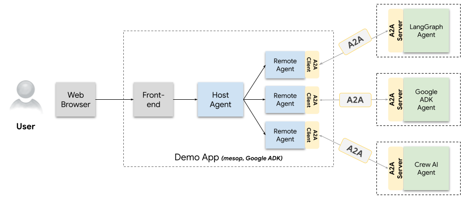

## Demo Web App

This demo application showcases agents talking to other agents over the Agent-to-Agent (A2A) protocol. It highlights how specialized, independent agents can be integrated and orchestrated to solve complex user requests.



## Agent Architecture

The demonstration is built around a powerful, modular architecture where a central agent delegates work to remote, specialized agents using the A2A standard.

### Components

You begin by building agents using the [Agent Development Kit](https://google.github.io/adk-docs/) (ADK). ADK is an open-source toolkit developed by Google that simplifies agent construction. While any agent development framework such as [LangGraph](https://www.langchain.com/langgraph) or [CrewAI](https://www.crewai.com/) can be used, this tutorial focuses on ADK to build the core agents.

- **Frontend**: The frontend is a [mesop](https://github.com/mesop-dev/mesop) web application that renders conversations as content between the end user and the "Host Agent". This app can render text content, thought bubbles, web forms (requests for input from agents), and images. More content types will be added soon.

- **Host Agent (Client)**: The [Host Agent](/samples/python/hosts/multiagent/host_agent.py) is a Google ADK agent which orchestrates user requests to Remote Agents.

- **Remote Agent**: Each [Remote Agent](/samples/python/hosts/multiagent/remote_agent_connection.py) is an A2AClient running inside a Google ADK agent. Each remote agent will retrieve the A2AServer's [AgentCard](https://google.github.io/A2A/#documentation?id=agent-card) and then proxy all requests using A2A.

### [How to build it piece by piece] Converting an Agent to A2A

Both the remote agent (e.g., the Reimbursement Agent) and the Host Agent leverage A2A to collaborate effectively. To convert an agent's core logic into a compliant A2A agent, you define three main components: the **Agent Skill**, the **Agent Card**, and the **Agent Executor**.

#### 1. Agent Skill and Agent Card (Metadata)

The **Agent Skill** declares what the agent can do, and the **Agent Card** is the agent's digital business card, advertising its name, version, location (`url`), and available skills.

```python
skill = AgentSkill(
            id='process_reimbursement',
            name='Process Reimbursement Tool',
            description='Helps with the reimbursement process for users given the amount and purpose of the reimbursement.',
            tags=['reimbursement'],
            examples=[
                'Can you reimburse me $20 for my lunch with the clients?'
            ],
        )
        agent_card = AgentCard(
            name='Reimbursement Agent',
            description='This agent handles the reimbursement process for the employees given the amount and purpose of the reimbursement.',
            url=f'http://{host}:{port}/',
            version='1.0.0',
            default_input_modes=ReimbursementAgent.SUPPORTED_CONTENT_TYPES,
            default_output_modes=ReimbursementAgent.SUPPORTED_CONTENT_TYPES,
            capabilities=capabilities,
            skills=[skill],
        )
```
#### 2. Agent Executor (Execution Logic)
The Agent Executor is the bridge between the A2A protocol and the agent's core business logic (ReimbursementAgent). It implements the A2A execution interface, handles the request/task lifecycle, and manages the streaming of status updates and final artifacts back to the client.


```python
import json

from a2a.server.agent_execution import AgentExecutor, RequestContext
from a2a.server.events import EventQueue
from a2a.server.tasks import TaskUpdater
from a2a.types import (
    DataPart,
    Part,
    Task,
    TaskState,
    TextPart,
    UnsupportedOperationError,
)
from a2a.utils import (
    new_agent_parts_message,
    new_agent_text_message,
    new_task,
)
from a2a.utils.errors import ServerError
from agent import ReimbursementAgent

class ReimbursementAgentExecutor(AgentExecutor):
    """Reimbursement AgentExecutor Example."""

    def __init__(self):
        self.agent = ReimbursementAgent()

    async def execute(
        self,
        context: RequestContext,
        event_queue: EventQueue,
    ) -> None:
        query = context.get_user_input()
        task = context.current_task

        # This agent always produces Task objects. If this request does
        # not have current task, create a new one and use it.
        if not task:
            task = new_task(context.message)
            await event_queue.enqueue_event(task)
        updater = TaskUpdater(event_queue, task.id, task.context_id)
        # invoke the underlying agent, using streaming results. The streams
        # now are update events.
        async for item in self.agent.stream(query, task.context_id):
            is_task_complete = item['is_task_complete']
            artifacts = None
            if not is_task_complete:
                await updater.update_status(
                    TaskState.working,
                    new_agent_text_message(
                        item['updates'], task.context_id, task.id
                    ),
                )
                continue
            # If the response is a dictionary, assume its a form
            if isinstance(item['content'], dict):
                # Verify it is a valid form
                if (
                    'response' in item['content']
                    and 'result' in item['content']['response']
                ):
                    data = json.loads(item['content']['response']['result'])
                    await updater.update_status(
                        TaskState.input_required,
                        new_agent_parts_message(
                            [Part(root=DataPart(data=data))],
                            task.context_id,
                            task.id,
                        ),
                        final=True,
                    )
                    continue
                await updater.update_status(
                    TaskState.failed,
                    new_agent_text_message(
                        'Reaching an unexpected state',
                        task.context_id,
                        task.id,
                    ),
                    final=True,
                )
                break
            # Emit the appropriate events
            await updater.add_artifact(
                [Part(root=TextPart(text=item['content']))], name='form'
            )
            await updater.complete()
            break

    async def cancel(
        self, request: RequestContext, event_queue: EventQueue
    ) -> Task | None:
        raise ServerError(error=UnsupportedOperationError())
```
#### Agent Interaction Flow
- Start the host and client:
    - Clone this [GitHub repo](https://github.com/a2aproject/a2a-samples).

## Features

| Feature | Description |
| :--- | :--- |
| **Dynamically add agents** | Clicking the robot icon lets you add new agents. Enter the remote agent's **AgentCard address** (URL) to fetch its capabilities and add it to the Host Agent's list of known collaborators. |
| **Speak with one or more agents** | Start a conversation that goes to the Host Agent, which then delegates the request to the relevant remote agent(s). The frontend renders complex content—like images or web-forms—as returned by the agent. |
| **Explore A2A Tasks** | The history view shows the raw messages sent between the web app and all agents (Host and Remote). The task list displays the critical A2A task updates and state changes from the remote agents. |

### Explore A2A Tasks

- Click **history** to see the messages sent between the web app and all of the agents (Host agent and Remote agents).

- Click the task list to see all the A2A task updates from the remote agents.

## Prerequisites

- Python 3.12 or higher
- UV
- Agent servers speaking A2A ([use these samples](/samples/python/agents/README.md))
- Authentication credentials (API Key or Vertex AI)

## Run the Examples

We have already built it for you - just download and run it. For convenience, the sample agents (the Remote Agent and the Host Agent) have been pre-built.

1. Navigate to the demo ui directory:
   ```bash
   cd demo/ui
   ```
2. Create an environment file with your API key or enter it directly in the UI when prompted:

   **Option A: Google AI Studio API Key**

   ```bash
   echo "GOOGLE_API_KEY=your_api_key_here" >> .env
   ```

   Or enter it directly in the UI when prompted.

   **Option B: Google Cloud Vertex AI**

   ```bash
   echo "GOOGLE_GENAI_USE_VERTEXAI=TRUE" >> .env
   echo "GOOGLE_CLOUD_PROJECT=your_project_id" >> .env
   echo "GOOGLE_CLOUD_LOCATION=your_location" >> .env
   ```

   Note: Ensure you've authenticated with gcloud using `gcloud auth login` first.

   For detailed instructions on authentication setup, see the [ADK documentation](https://google.github.io/adk-docs/get-started/quickstart/#set-up-the-model).

3. Run the front end example:

   ```bash
   uv run main.py
   ```

   Note: The application runs on port 12000 by default

4. Interact with the demo, and add some sample agents which speak A2A:

   You can ask the demo agent _"What remote agents do you have access to?"_
   and there should not be any.

   Next go start up **any** sample agent:

   ```bash
   cd ../../samples/python/agents/adk_expense_reimbursement/
   cp ../../../../demo/ui/.env ./
   uv run .
   ```

   Back in the demo UI you can go to the _Remote Agents_ tab and add this agent's address:

   ```
   localhost:10002
   ```

   Then you can converse with the demo agent and it should now have access to the _Reimbursement Agent_.

   You can ask it to _"reimburse lunch for 20 EUR but needs to be converted to USD ahead of time."_

   Answer it's questions in a normal... If you need help converting currency, try adding the LangGraph sample agent too.

   Review the events to see what happened.

## Build Container Image

Agent can also be built using a container file.

1. Navigate to the `samples/python` directory:

  ```bash
  cd samples/python
  ```

2. Build the container file

    ```bash
    podman build -f demo/ui/Containerfile . -t a2a-ui
    ```

> [!Tip]  
> Podman is a drop-in replacement for `docker` which can also be used in these commands.

3. Run you container

    ```bash
    podman run -p 12000:12000 --network host a2a-ui
    ```

> [!Important]  
> Using the `host` network not recommended in production.
