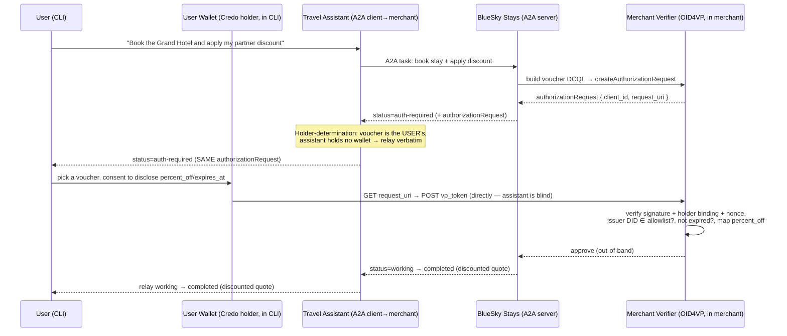

# OID4VP In-Task Authorization Extension — Partner Discount Vouchers Demo

A demo of the [OID4VP In-Task Authorization A2A extension](https://github.com/a2aproject/experimental-ext-oid4vp-auth):
a hotel-booking agent ("BlueSky Stays") that honors discount vouchers issued by partner travel
brands, where the buyer is represented by a personal assistant agent that relays the
authorization request to the user's wallet.

It is built with [Genkit](https://genkit.dev/) + the OpenAI API for the agents, and the
[OWF Credo](https://credo.js.org/) framework as the Verifiable Credentials wallet / verifier
(OID4VP Holder and Verifier).

> This is sample code, not intended for production-quality usage. See the **Disclaimer** at the end.

## Use case - why Verifiable Credentials and OID4VP here (and not plain OAuth)?

- **Issuer ≠ verifier, with no integration.** The partner brands that issue vouchers (an airline
  loyalty program, a bank travel program, …) do not have a direct integration with a merchant that accepts them. The
  merchant trusts a VC (checked against a list of trusted issuers) — not
  a partner backend or a shared database. Onboarding a new partner is just adding its DID.
- **Portability across many issuers.** The same kind of voucher is accepted from any trusted brand;
  no per-partner OAuth federation.
- **Just-in-time, content-driven.** Authorization fires only when the user asks to apply a
  discount — not as a login process.
- **Selective disclosure / privacy.** The voucher reveals only `percent_off` / `expires_at`;
  identity, voucher id and even the issuing brand name stay hidden.
- **Replay-proofing.** Voucher VCs are bound to holder, so a leaked voucher can't be
  presented by another party — something that a plain coupon code is not providing.

## Roles and topology

The A2A Client is the user's assistant agent. Because the voucher belongs to the user, the assistant cannot satisfy the
request itself: it relays the authorization request to the user's wallet, which then talks
directly to the merchant's verifier. The assistant is pure transport and never sees the
VC.

| Process                                  | A2A role                                              | OID4VP role                                    | Port(s)                      |
|------------------------------------------|-------------------------------------------------------|------------------------------------------------|------------------------------|
| User CLI + wallet (`src/cli.ts`)         | A2A Client (to the assistant)                         | Holder (Credo) — holds the pre-issued vouchers | none (outbound calls only)   |
| Travel Assistant (`src/assistant/`)      | A2A Server (to the CLI) + A2A Client(to the merchant) | none — relays the request, never holds the VP  | A2A `10004`                  |
| BlueSky Stays merchant (`src/merchant/`) | A2A Server (to the assistant)                         | Verifier (Credo + OID4VP server)               | A2A `10003`, verifier `3001` |



The relayed `authorizationRequest`'s `client_id` / `request_uri` keep pointing at the merchant
verifier (`:3001`), so the wallet's presentation goes directly to the merchant — confirming the
assistant is blind to the credential.

## The credential schema

A `DiscountVoucher` SD-JWT VC, holder-bound:

```jsonc
{
  "vct": "DiscountVoucher",
  "issuer_brand": "Aurora Airlines Rewards",
  "percent_off": 25,
  "expires_at": "2027-01-01T00:00:00Z",
  "voucher_id": "aurora-gold-0001",
}
```

Three vouchers are pre-issued into the wallet at startup (issuance is out of scope for the extension):

| Brand (issuer)          | On merchant allowlist? | Discount |
|-------------------------|------------------------|----------|
| Aurora Airlines Rewards | ✅                     | 25%      |
| Meridian Bank Travel    | ✅                     | 10%      |
| BargainTrips            | ❌                     | 50%      |

**Note**: BargainTrips issues a valid, very generous voucher — but our specific merchant does not have a partnership with it, and the issuer DID for BargainTrips voucher VC is not
on the merchant's allowlist. The result is that attempts to present BargainTrips voucher for discount are going to be rejected.

The merchant requests only the following claims (via selective disclosure):

```json
{
  "credentials": [
    {
      "id": "voucher",
      "format": "vc+sd-jwt",
      "meta": { "vct_values": ["DiscountVoucher"] },
      "claims": [{ "path": ["percent_off"] }, { "path": ["expires_at"] }]
    }
  ],
  "credential_sets": [{ "options": [["voucher"]], "purpose": "Apply partner discount" }]
}
```

## Running the demo

### 1. Prerequisites

- [Node.js](https://nodejs.org/) v18+
- [pnpm](https://pnpm.io/) (the project is pnpm-pinned; `npm install` also works)
- An OpenAI API key

### 2. Setup

```bash
cd a2a-samples-demo
pnpm install
cp .env.example .env        # then edit .env and set OPENAI_API_KEY
```

Apart from `OPENAI_API_KEY`, the chat model can be overridden with `OPENAI_MODEL` (defaults to `gpt-4o-mini`).
The ports, agent URLs, and the merchant's auth-wait timeout are all configurable too — see
`.env.example` for the full list and defaults.

### 3. Start the three processes (three terminals)

```bash
pnpm run merchant     # BlueSky Stays: A2A on :10003, OID4VP verifier on :3001
pnpm run assistant    # Travel Assistant: A2A on :10004 (forwards to the merchant)
pnpm run client       # User CLI + wallet (talks to the assistant on :10004)
```

Start the merchant first, then the assistant, then the client.

### 4. Try it

The user wallet is provisioned with the three voucher VCs, then you can chat:

- **Apply a valid discount** — `Book a deluxe room for 2 nights and apply my partner discount`
  → the assistant relays an `auth-required`; pick the **Aurora** (25%) voucher; confirm
  disclosure → the merchant prices the stay (2 × $300) and applies 25% → **$450.00**.
- **Trust failure** — ask again and pick **BargainTrips** (50%) → the merchant **rejects** it (issuer
  not a partner) and quotes the un-discounted **$600.00**.
- **No discount (no auth)** — `Just book me a standard room for Saturday` → no credential is requested
  at all; **$200.00** (1 night, standard).

> **Repeating the flow.** Each discount booking triggers a fresh authorization, so you can re-run the
> demo in the same session and present a different voucher each time — no reset needed (`/new` just
> starts a new conversation).

Example client transcript:

```text
👛 Wallet provisioned with 3 discount voucher(s):
   • Aurora Airlines Rewards: 25% off (expires 2027-01-01T00:00:00Z)
   • Meridian Bank Travel: 10% off (expires 2027-01-01T00:00:00Z)
   • BargainTrips: 50% off (expires 2027-01-01T00:00:00Z)

Travel Assistant > You: Book a deluxe room for 2 nights and apply my partner discount
Travel Assistant: ⏳ working   Forwarding your request to BlueSky Stays on your behalf...
Travel Assistant: 🔐 auth-required
  📝 BlueSky Stays needs a partner discount voucher. I don't hold your vouchers, so please present one from your wallet.

🔐 The agent requested a verifiable credential (purpose: "Apply partner discount").
Your wallet holds 3 matching credential(s):
  [1] Aurora Airlines Rewards — 25% off, expires 2027-01-01T00:00:00Z
  [2] BargainTrips — 50% off, expires 2027-01-01T00:00:00Z
  [3] Meridian Bank Travel — 10% off, expires 2027-01-01T00:00:00Z
Choose a voucher to present (1-3), or 'n' to decline: 1

Presenting will disclose ONLY: {"percent_off":25,"expires_at":"2027-01-01T00:00:00Z"}
(Your identity, voucher id and issuing brand stay private.)
Confirm sharing? (yes/no): yes
✓ Presentation sent to the verifier.

Travel Assistant: ✅ completed [FINAL]
  📝 Quote for 2 nights in a deluxe room: $600.00, with your Aurora Airlines Rewards partner discount (25% off) applied -> final price $450.00.
```

## Disclaimer

Important: The sample code provided is for demonstration purposes and illustrates the mechanics of the
Agent-to-Agent (A2A) protocol and the OID4VP In-Task Authorization extension. When building production
applications, it is critical to treat any agent operating outside of your direct control as a
potentially untrusted entity.

All data received from an external agent — including but not limited to its AgentCard, messages,
artifacts, and task statuses — should be handled as untrusted input. For example, a malicious agent
could provide an AgentCard containing crafted data in its fields (e.g., description, name,
skills.description). If this data is used without sanitization to construct prompts for a Large
Language Model (LLM), it could expose your application to prompt injection attacks. Failure to
properly validate and sanitize this data before use can introduce security vulnerabilities into your
application.

Developers are responsible for implementing appropriate security measures, such as input validation
and secure handling of credentials, to protect their systems and users.
