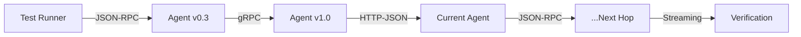

# 🛠 ITK: Integration Test Kit


ITK is a technical toolkit designed to verify compatibility across different A2A SDK implementations and versions. It uses a multi-hop traversal model to ensure that messages can be routed across a cluster of agents using varied transport protocols (JSON-RPC, gRPC, and HTTP-JSON/REST), including support for streaming.

---

## 🏗 Architecture

The kit operates by dispatching a single, deeply nested instruction through a chain of agents. Each "hop" in the chain requires the receiving agent to resolve the next target's agent card, map the requested transport, and forward the remaining instructions.



---

## 📈 Graph-Based Traversal

To achieve comprehensive verification, ITK utilizes graph-based traversal algorithms:

- **Eulerian Circuits**: Implements **Hierholzer's Algorithm** to generate a single linear nested instruction chain that covers 100% of directed edges in the agent cluster exactly once.
- **Dynamic Topology**: Supports complete digraphs (n-to-n) or custom edge definitions to test specific connection patterns.

---

## 🌟 Key Features

### 🔌 Extensible SDK Support
While currently featuring implementations for **Go** and **Python** (v0.3 and v1.0), ITK is designed to be language-agnostic. Any A2A-compliant SDK can be integrated into the test suite by providing a compatible agent launcher.
- **Current Agent Pattern**: Allows testing of a local SDK implementation against stable baseline agents by mounting the local source into a standard "current" agent container/process.

### 🛤 Multi-Protocol & Streaming
Seamlessly switches transport protocols between hops:
- **JSON-RPC**
- **gRPC**
- **HTTP-JSON (REST)**
- Full support for **Streaming** instructions across all compatible transports.

### 🎭 Dual Orchestration
- **CLI (`run_tests.py`)**: A powerful command-line tool for local development, pre-configured with a battery of cross-version and cross-protocol scenarios.
- **Web Service (`itk_service.py`)**: A FastAPI-based service providing a REST API (`/run`) to trigger test executions remotely, designed for CI/CD integration.

### ⚡ Zero-Configuration Lifecycle
- **Dynamic Port Allocation**: Automatically finds and assigns free TCP ports for agents, enabling parallel execution of test clusters without port conflicts.
- **Automated Readiness**: Uses the A2A SDK itself to verify that each agent in the cluster is fully initialized and reachable before dispatching tests.

---

## 📂 Project Structure

- `agents/`: SDK-specific agent implementations (e.g., Go, Python).
- `test_suite/`: Modular agent definitions, launchers, and traversal logic.
- `itk_service.py`: FastAPI orchestration service for remote test execution.
- `run_tests.py`: CLI orchestrator for running concurrent test scenarios.
- `testlib.py`: Core logic for cluster lifecycle, port management, and test execution.
- `Dockerfile`: Production-ready container for the ITK service.

---

## 🚀 Getting Started

### Prerequisites
- **uv**: Python package and project manager.
- **Go 1.22+**: Required for Go agent builds.
- **Node.js v20**: Required for certain A2A utility components.

### Execution

#### 1. Local CLI Execution
Run the standard integration suite:
```bash
uv run run_tests.py
```

#### 2. Running as a Service
Start the orchestration API:
```bash
uv run itk_service.py
```

#### 3. Docker Usage
Build and run the ITK service container:
```bash
docker build -t itk_service .
docker run -p 8000:8000 itk_service
```
