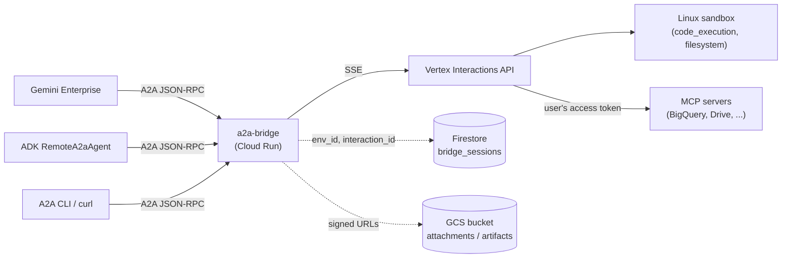

# a2a-bridge

> [!NOTE]
> **Preview.** The bridge tracks the Vertex Interactions API at
> `Api-Revision: 2026-05-20`. Event names and tool-type values upstream
> are still moving; expect minor breaking changes.

**a2a-bridge** is a self-hosted Cloud Run service that exposes the
[Managed Agents API](https://cloud.google.com/vertex-ai) over the
[A2A protocol](https://a2a-protocol.org/). Deploy one container in your own
project and any A2A client (Gemini Enterprise, ADK's `RemoteA2aAgent`, the
A2A CLI, a third-party orchestrator) can drive a Managed Agent's persistent
Linux sandbox, with code execution and per-user MCP tool access, against your
own data.

## Overview



The bridge is a stateless protocol translator with no model loop and no conversation
history of its own. For each A2A turn it verifies the caller, looks up the
session's `environment_id` and `previous_interaction_id`, translates A2A
`Part`s into Interactions API content, streams the SSE response back as A2A
`TaskStatusUpdate`s, and saves the new IDs so the next turn lands in the same
sandbox.

What you get:

- **Per-user data access.** MCP tools (BigQuery, Drive, internal APIs) act as
  the calling end user rather than a shared service account, opt-in per tool
  via `forward_user_auth`.
- **Persistent sandbox.** Each conversation reattaches to the same Linux
  environment across turns, so installed packages, cloned repos, and loaded
  DataFrames survive.
- **Multi-agent routing.** One deployment serves every entry in `agents.json`
  under `/{key}/...`, so one bridge covers the whole catalogue.
- **Structured tool output.** Function results stream back as A2A `DataPart`s
  next to the rendered text, so an orchestrating agent can branch on raw
  values instead of parsing markdown.
- **Cross-client resume.** The Firestore session store and `GET /sessions` let
  a CLI pick up a conversation that started in Gemini Enterprise.
- **File in / file out.** Inbound attachments arrive in `/workspace/uploads/`;
  outbound artifacts leave the sandbox through a per-turn signed `PUT`.
- **Customer-controlled.** Runs in your project, inside your VPC-SC perimeter,
  on your service account.

## Quickstart

Three commands stand up the bridge and send it a turn.

```bash
pip install -e '.[dev]'        # installs the `a2a-bridge` CLI (serve + admin)
export PROJECT_ID=my-project
make bootstrap PROJECT_ID=$PROJECT_ID AGENT_KEY=business-analyst
```

`make bootstrap` runs `tf-init tf-apply build deploy setup-agent` in order:

- **Terraform** provisions the Cloud Run service (initially on a placeholder
  image, so the first apply doesn't depend on a pushed build), its service
  account and IAM, the Artifact Registry repo, the GCS bucket, and the
  Firestore session database.
- **build / deploy** push `bridge:latest` and point Cloud Run at it. The
  container reads `/app/agents.json` (override with `AGENTS_CONFIG`).
- **setup-agent** creates the managed agent from the `agents.json` entry for
  `AGENT_KEY` and uploads `agent-template/` to the bucket.

`AGENT_KEY` defaults to the registry's `default` agent. The individual targets
(`make tf-apply`, `make build`, ...) stay available for re-running one step.

### Send a turn

Cloud Run's IAM and the bridge each verify a credential, so a direct call
carries two headers: Cloud Run strips the signature from a Google ID token in
`Authorization`, so the ID token goes in `X-Serverless-Authorization` and the
user's access token in `Authorization`.

```bash
URL=$(gcloud run services describe a2a-bridge --project $PROJECT_ID \
        --region us-central1 --format 'value(status.url)')
AT=$(gcloud auth application-default print-access-token)
IDT=$(gcloud auth print-identity-token)

curl -fsS -N "$URL/business-analyst" \
  -H "Authorization: Bearer $AT" \
  -H "X-Serverless-Authorization: Bearer $IDT" \
  -H 'content-type: application/json' \
  -d '{"jsonrpc":"2.0","id":"1","method":"message/stream",
       "params":{"message":{"messageId":"m1","role":"user",
         "parts":[{"kind":"text","text":"run uname -a"}]}}}'

# Your sessions, newest first
curl -fsS "$URL/sessions" \
  -H "Authorization: Bearer $AT" \
  -H "X-Serverless-Authorization: Bearer $IDT" | jq .
```

Direct callers need `roles/run.invoker`. Project owners have it implicitly;
grant it to anyone else who should call the bridge.

## Publish to Gemini Enterprise (optional)

Gemini Enterprise forwards the end user's access token only when the agent
registration references a DiscoveryEngine `Authorization`, which needs a
classic Web OAuth client. There's no API or Terraform resource for that kind
of client (`google_iam_oauth_client` is Workforce-Identity only), so create it
once by hand: Cloud Console > APIs & Services > Credentials > Create OAuth
client ID > Web application, redirect URI
`https://vertexaisearch.cloud.google.com/static/oauth/oauth.html`. Keep the
client id and secret.

```bash
export GE_APP_ID=my-ge-app_123          # GE console > your app > Settings
export OAUTH_CLIENT_ID=123-abc.apps.googleusercontent.com

# Create the Authorization (secret read from stdin, never in shell history)
a2a-bridge --project $PROJECT_ID create-authorization \
  --name business-analyst \
  --oauth-client-id $OAUTH_CLIENT_ID \
  --client-secret-stdin            # paste the secret, then Ctrl-D

# Register the agent in the GE app
make register-ge AGENT_KEY=business-analyst GE_APP_ID=$GE_APP_ID \
  URL=$URL GE_AUTHZ=business-analyst
```

The agent then shows up in GE chat with the starter prompts from `agents.json`.
If the secret already lives in Secret Manager, use
`--secret-from-secret-manager SECRET_ID` instead of `--client-secret-stdin`.

## CLI commands

`a2a-bridge` takes the global flags `--project`, `--location`, `--endpoint`,
`--config`, and `-v`, then a subcommand. Run `a2a-bridge <command> --help` for
its flags.

| Command | What it does |
| --- | --- |
| `serve` | Run the A2A server on `$PORT`, configured by [environment variables](#environment-variables). |
| `setup-agent` | Create or update `agents/{KEY}` on Vertex and sync `agent-template/` to GCS. |
| `create-authorization` | Create the DiscoveryEngine `Authorization` GE uses to mint per-user tokens. |
| `register-ge` | Register (or update) the GE agent pointing at the bridge's card. |
| `card` | Print the A2A agent card JSON (`--key` for one agent, else the catalogue). |
| `sync-template` | Upload the sandbox seed (`agent-template/`) to GCS. |
| `publish-skills` | Zip each skill directory and upsert it to the Vertex Skill Registry. |

For an agent the registry can't express, `setup-agent --body-file FILE` applies
a hand-authored body verbatim (after `${PROJECT_ID}` / `${BUCKET}`
substitution). The body's `id` is ignored; the resource id always comes from
`agents.json`, so the control plane can't drift from what the bridge serves.

## Configuration

### `agents.json`

[`agents.json`](agents.json) is the single source of truth: one file drives
both the runtime and every CLI command, so what's served can't drift from
what's registered. It has a top-level `default` and an `agents` map; each entry
sets `agent` (a managed agent ref like `agents/foo`, or a bare model id),
`display_name`, `description`, and optionally `system_instruction`, `tags`,
`default_tools`, `starter_prompts`, and `default_environment`. The checked-in
file is a working example.

Tool types are validated when the file loads. `default_tools[].type` accepts
data-plane types only: `code_execution`, `google_search`, `url_context`,
`mcp_server` (`mcp` is normalized to `mcp_server`). Control-plane-only types
like `filesystem` are rejected: the Interactions API and the Agents API accept
different tool vocabularies, and mixing them otherwise fails at runtime with an
opaque 400.

### Environment variables

| Name | Default | Purpose |
| --- | --- | --- |
| `PROJECT_ID` | *(required)* | GCP project for Vertex calls |
| `AGENTS_CONFIG` | *(required)* | Path or inline JSON for the registry |
| `LOCATION` | `global` | Vertex location |
| `VERTEX_ENDPOINT` | `https://aiplatform.googleapis.com` | API host |
| `ALLOW_ANONYMOUS` | `false` | Accept requests with no `Authorization` header |
| `ID_TOKEN_AUDIENCE` | *(request host)* | Expected `aud` on Google ID tokens; defaults to the request host URL |
| `FIRESTORE_DATABASE` | *(unset)* | Firestore database id; enables durable session continuity |
| `ENV_SCOPE` | `context` | `context` = one sandbox per conversation; `user` = one per end user |
| `IDLE_TTL_S` | `3600` | Evict idle in-memory sessions after this many seconds |
| `UPLOAD_BUCKET` | *(unset)* | Enables signed-URL attachment staging and artifact export |
| `PORT` | `8080` | Listen port |

The agent card URL and the ID-token audience are both derived from the incoming
request, so there's no separate public-URL setting to keep in sync.

## Authentication

Every non-public path needs `Authorization: Bearer <token>` unless
`ALLOW_ANONYMOUS=true`. Two token kinds are accepted:

- A **Google-signed ID token**, verified locally (signature and `aud`, no
  network call). It carries identity but no OAuth scopes, so per-user MCP isn't
  available.
- An **OAuth 2.0 access token**, validated via `oauth2.googleapis.com/tokeninfo`
  and cached until the token expires (or a short default if it reports no
  expiry). This is what GE sends with `authorizationConfig`, and what
  `forward_user_auth` injects into MCP tool headers.

The verified `sub` (or `email`) is hashed into the session owner key, so two
users never share a sandbox; a token with neither claim is rejected.
`/.well-known/agent-card.json` stays open.

Behind Cloud Run IAM, direct callers split the credentials across two headers:
ID token in `X-Serverless-Authorization`, access token in `Authorization` (see
[Send a turn](#send-a-turn)).

## Sessions

The Interactions API owns conversation history and the sandbox filesystem; the
bridge only remembers the pointer back, plus the metadata `GET /sessions`
lists.

- **In-memory** (default): a process-local map with idle eviction. Fine for a
  single instance or local development.
- **Firestore** (`FIRESTORE_DATABASE`): one document per session (keyed
  `{owner}:{context_id}:{agent_key}`, or `{owner}:{agent_key}` when
  `ENV_SCOPE=user`) in the `bridge_sessions` collection, holding `env_id`,
  `interaction_id`, `owner`, `agent_key`, `context_id`, and `updated_at`. It
  survives restarts; pair it with a 7-day TTL on `updated_at` to match the
  upstream environment lifetime.

`GET /sessions` returns the caller's sessions newest-first. A client lists
them, picks the `context_id` for the agent it wants, and sends the next turn
with that `context_id` to land back in the same sandbox. This is how a CLI
resumes a conversation that began in GE.

> The bridge runs as a single Cloud Run instance (`max_instance_count = 1`);
> session turns are serialized by a process-local lock. Running multiple
> instances needs a cross-instance guard on the session pointer first.

## Attachments

Inbound `raw` / `url` parts up to 64 KiB are handled inline, no bucket needed:

- **Images and PDFs** go through as native typed content (images as
  `{type: "image"}`, PDFs as `{type: "document"}`) with base64 `data` and the
  `mime_type`, so the model reads them directly. Only an unrecognized mime type
  is dropped.
- **Everything else** is inlined as a base64 text block with an instruction to
  decode it into `/workspace/uploads/<name>`.

Setting `UPLOAD_BUCKET` adds two bucket-backed paths:

- **Large parts** are uploaded and handed to the model as a signed
  `curl -fsSL -o ...` command; the sandbox has no GCP credentials, so it
  fetches over HTTPS rather than `gsutil`.
- **Artifact export**: each turn carries an `[artifact-export]` block with a
  one-shot signed `PUT` URL and matching download link; the
  `agent-template/skills/artifact-export/` skill teaches the model to use it.

## Security

Firestore ships with deny-all rules in
[`terraform/firestore.rules`](terraform/firestore.rules). The bridge reaches
Firestore server-side through its runtime service account (the Admin/IAM path),
which bypasses Security Rules, so denying all client access is pure defense in
depth and doesn't affect the bridge. After deploying, confirm both halves: a
client-SDK or REST read of `bridge_sessions` returns `PERMISSION_DENIED`, while
a bridge round-trip (send a turn, then `GET /sessions`) still works.

## What this is not

- **Not a managed service.** It runs in your project on your Cloud Run. A
  Google-hosted A2A endpoint for Managed Agents is tracked separately; both
  speak the same wire contract, so clients can repoint without code changes.
- **Not an agent framework.** The bridge translates protocols; it doesn't
  define how you build the agent. Use the Agents API (or `--body-file`) for
  that.
- **Not a model loop.** No history, planner, or retry policy of its own; the
  Interactions API owns all of that.

## Development

```text
bridge/           runtime: A2A executor, auth, stream consumer, session store
cli/              a2a-bridge subcommands (serve, setup-agent, register-ge, ...)
terraform/        Cloud Run, SA, IAM, Artifact Registry, optional bucket/Firestore
agent-template/   sandbox seed (AGENTS.md + skills), synced to GCS and mounted
tests/            pytest, no network
```

`agent-template/` is the bridge's own seed content that every synthesised agent
inherits, not an example to copy.

```bash
make lint     # ruff + mypy
make test     # pytest (no network)
make serve    # local uvicorn against ADC
```

## License

Apache 2.0. See [LICENSE](LICENSE).
