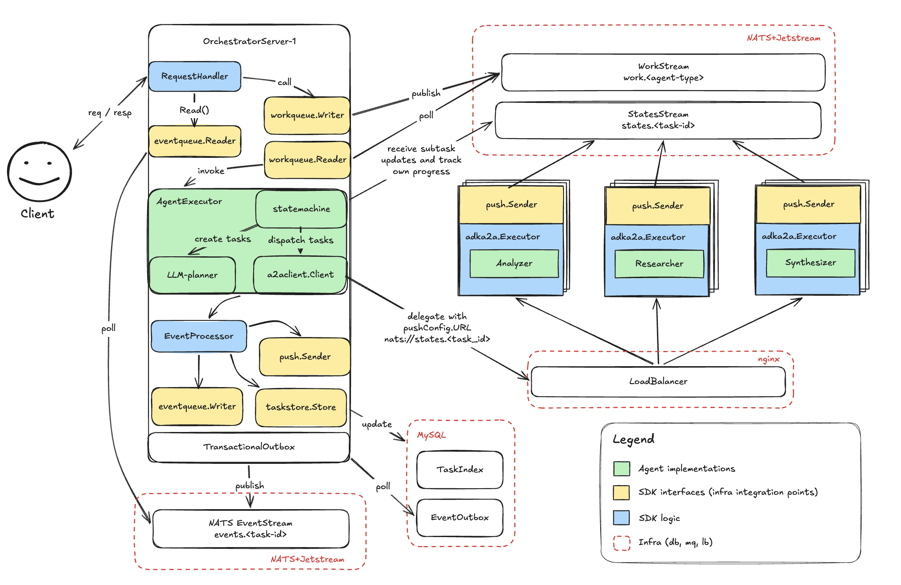
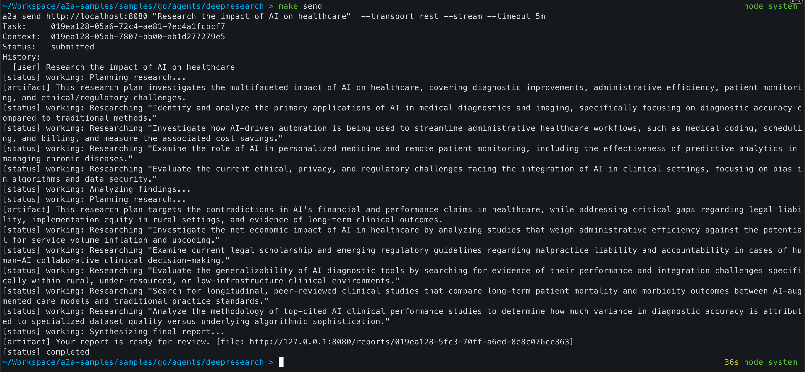

# Deep Research

A multi-agent system that performs deep research on a given topic. The project showcases way of implementing the standard SDK interfaces for integrating with various popular infra components like MySQL and NATS.

Built using [a2a-go](https://github.com/a2aproject/a2a-go) and [adk](https://github.com/google/adk-go).

## Overview

* Horizontally scalable cluster of different agent types: orchestrator, researcher, analyzer, and synthesizer. 
* MySQL for task indexing and Jetstream for event persistence.
* Push notification sender for signaling subtask completion to the orchestrator.
* NATS for work distribution, event and push notification delivery.
* Retryable execution with state checkpointing. 

## Running

1. Rename `.example.env` to `.env` and update your `GOOGLE_API_KEY` ([learn more](https://docs.cloud.google.com/docs/authentication/api-keys)).

2. Start the full stack using docker-compose by running `make up`. 

3. Call orchestrator using [a2a-cli](https://github.com/a2aproject/a2a-go#-cli) (`make send`), [a2a-inspector](https://github.com/a2aproject/a2a-inspector) or another client.

## Details

Orchestrator agents handle client requests:
1. Uses LLM planner to decompose a question into subtasks.
2. Dispatches them to a cluster of researcher agents with `returnImmediately: true`.
3. Waits for results using NATS-based push notifications.
4. Invokes an analyzer to find contradictory topics for a follow-up research.
5. Initiates the follow-up research.
6. Invokes a synthesizer to generate a final report.

If an orchestrator crashes, the state machine replays its event stream from the NATS STATES stream to recover which stages were dispatched and which completed, then resumes from where it left off. 

Orchestrator never loads large task contents into memory and instead uses task references when communicating with synthesizer and analyzer. The final report is returned to a user a reference.

Push notifications allow orchestrator to limit the number of open long-lived connections and avoid subtask status polling.

