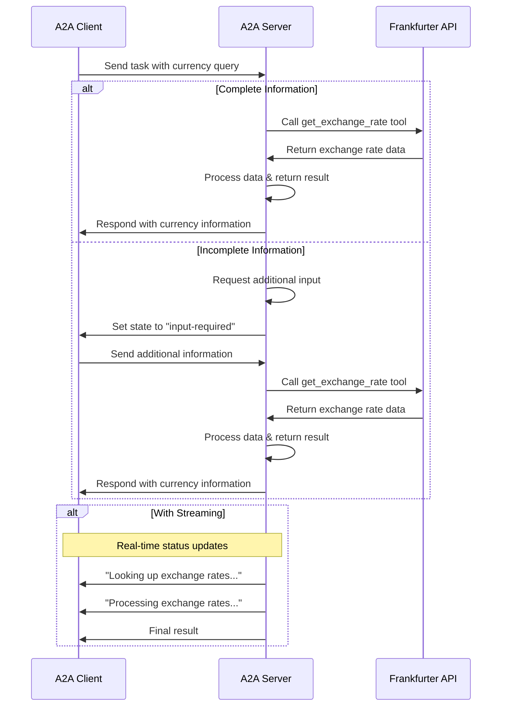

# Currency Exchange Rates

This sample demonstrates a currency conversion agent exposed through the A2A protocol.
It showcases conversational interactions with support for multi-turn dialogue and streaming responses.
The agent is written using Quarkus LangChain4j and makes use of the [A2A Java](https://github.com/a2aproject/a2a-java) SDK.

## How It Works

This agent uses an Ollama LLM (for example, qwen2.5:7b) to provide currency exchange information.
The A2A protocol enables standardized interaction with the agent, allowing clients to send requests and receive real-time updates.



## Key Features

- **Multi-turn Conversations**: Agent can request additional information when needed
- **Real-time Streaming**: Provides status updates during processing
- **Conversational Memory**: Maintains context across interactions
- **Currency Exchange Tool**: Integrates with Frankfurter API for real-time rates

## Prerequisites

- Java 17 or higher
- Access to an LLM (Ollama)
- Ollama installed (see [Download Ollama](https://ollama.com/download))

## Running the Sample

This sample consists of an A2A server agent, which is in the `server` directory, and an A2A client,
which is in the `client` directory.

### Running Ollama

1. Launch the Ollama server by default on port 11434 ([Local Ollama server](http://localhost:11434))

    ```bash
   ollama serve
    ```

2. In this example, we use the model qwen2.5:7b. Download this model and run it

    ```bash
   ollama pull qwen2.5:7b
   ollama run qwen2.5:7b
    ```

### Running the A2A Server Agent

1. Navigate to the `currency_exchange_rates` sample directory:

    ```bash
    cd samples/java/agents/currency_exchange_rates/server
    ```

2. Start the A2A server agent

   **NOTE:**
   By default, the agent will start on port 10000. To override this, add the `-Dquarkus.http.port=YOUR_PORT`
   option at the end of the command below.

   ```bash
   mvn quarkus:dev
   ```

### Running the A2A Java Client

The Java `TestClient` communicates with the Currency Agent using the A2A Java SDK.

Since the A2A server agent's [transport](samples/java/agents/currency_exchange_rates/server/pom.xml) is JsonRpc and since our client
also [supports](client/src/main/java/com/samples/a2a/TestClient.java) gRPC and JsonRpc, the JsonRpc transport will be used.

1. Make sure you have [JBang installed](https://www.jbang.dev/documentation/guide/latest/installation.html)

2. Run the client using the JBang script:

   ```bash
   cd samples/java/agents/currency_exchange_rates/client/src/main/java/com/samples/a2a/client
   jbang TestClientRunner.java
   ```
## Expected Client Output

The Java A2A client will:
1. Connect to the currency agent
2. Fetch the agent card
3. Automatically select JsonRpc as the transport to be used
4. Send the message "how much is 10 USD in INR?"
5. Display the exchange rate result from the agent
6. Send the message "How much is the exchange rate for 1 USD?"
7. Receive the request for additional input "Please specify the currency you want to convert USD to"
8. Send additional information "CAD"
9. Display the exchange rate result from the agent

## Learn More

- [A2A Protocol Documentation](https://a2a-protocol.org/)
- [Frankfurter API](https://www.frankfurter.app/docs/)
- [Ollama](https://docs.ollama.com/)

## Disclaimer
Important: The sample code provided is for demonstration purposes and illustrates the
mechanics of the Agent-to-Agent (A2A) protocol. When building production applications,
it is critical to treat any agent operating outside of your direct control as a
potentially untrusted entity.

All data received from an external agent—including but not limited to its AgentCard,
messages, artifacts, and task statuses—should be handled as untrusted input. For
example, a malicious agent could provide an AgentCard containing crafted data in its
fields (e.g., description, name, skills.description). If this data is used without
sanitization to construct prompts for a Large Language Model (LLM), it could expose
your application to prompt injection attacks.  Failure to properly validate and
sanitize this data before use can introduce security vulnerabilities into your
application.

Developers are responsible for implementing appropriate security measures, such as
input validation and secure handling of credentials to protect their systems and users.
