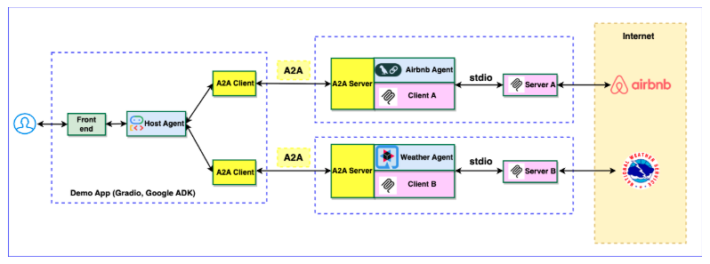
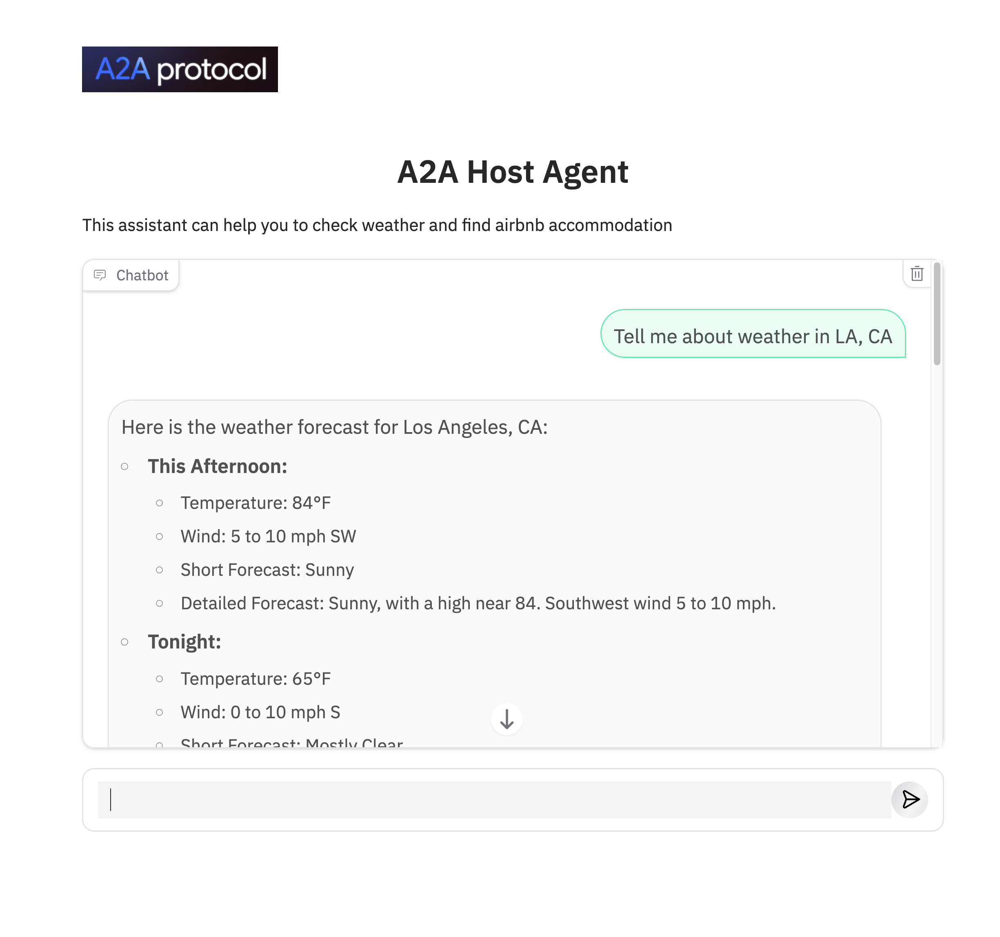

# Using A2A for multi-agent orchestration with Python and Java agents
----
> *⚠️ DISCLAIMER: THIS DEMO IS INTENDED FOR DEMONSTRATION PURPOSES ONLY. IT IS NOT INTENDED FOR USE IN A PRODUCTION ENVIRONMENT.*  

> *⚠️ Important: A2A is a work in progress (WIP) thus, in the near future there might be changes that are different from what demonstrated here.*
----

This sample is based off the Python [airbnb_planner_multiagent](../../python/agents/airbnb_planner_multiagent) sample and highlights how to use Google's Agent to Agent (A2A) protocol for multi-agent orchestration where at least one of the agents is a Java agent. 

This sample makes use of the [Java SDK for A2A](https://github.com/a2aproject/a2a-java). The application features a host agent coordinating tasks between a Python remote agent and a Java remote agent that interact with various MCP servers to fulfill user requests.

## Architecture

The application utilizes a multi-agent architecture where a host agent delegates tasks to remote agents (Airbnb and Weather) based on the user's query. These agents then interact with corresponding MCP servers.

The Weather agent is implemented in **Java** while the Airbnb agent is implemented in **Python**.



### Java Agent

The Weather app is a Quarkus application that depends on our A2A Java SDK to communicate with a Python A2A client
using the A2A protocol. It provides weather information based on user queries by leveraging a Python MCP server
that retrieves weather data from https://api.weather.gov.

Let's take a closer look at the classes that make up the Weather app:

- **[WeatherAgent](weather_agent/src/main/java/com/samples/a2a/WeatherAgent.java)**: This is a Quarkus LangChain4j [AiService](https://docs.quarkiverse.io/quarkus-langchain4j/dev/ai-services.html). It connects to a weather MCP server and exposes an AI method to handle weather-related requests.


- **[WeatherAgentCardProducer](weather_agent/src/main/java/com/samples/a2a/WeatherAgentCardProducer.java)**: This class has a method that creates the A2A `AgentCard` that describes what our Weather Agent can do. This allows other agents or clients to find out about our Weather Agent's capabilities.


- **[WeatherAgentExecutorProducer](weather_agent/src/main/java/com/samples/a2a/WeatherAgentExecutorProducer.java)**: This class has a method that creates the A2A `AgentExecutor` that will be used to send queries to the Weather Agent and to send responses and updates back to the A2A client. The agent executor is meant to be a bridge between the A2A protocol and the agent's logic.


#### A2A Java SDK
The `AgentCard` and `AgentExecutor` classes mentioned above are part of the [A2A Java SDK](https://github.com/a2aproject/a2a-java). Notice that our Weather app's [`pom.xml`](weather_agent/pom.xml) has a dependency on the `a2a-java-sdk-core` and `a2a-java-sdk-server-quarkus` libraries:

```xml
...
<properties>
    <io.a2a.sdk.version>0.2.3</io.a2a.sdk.version>
    ...
</properties>    
...
<dependency>
    <groupId>io.a2a.sdk</groupId>
    <artifactId>a2a-java-sdk-core</artifactId>
    <version>${io.a2a.sdk.version}</version>
</dependency>
<dependency>
    <groupId>io.a2a.sdk</groupId>
    <artifactId>a2a-java-sdk-server-quarkus</artifactId>
    <version>${io.a2a.sdk.version}</version>
</dependency>
...
```

Simply adding these dependencies to your Java application and providing `AgentCard` and `AgentExecutor` producers  makes it possible to easily run agentic Java applications as A2A servers using the A2A protocol. 

Note that we used the `a2a-java-sdk-server-quarkus` library in this example since our app is a Quarkus application. You can also use the `a2a-java-sdk-server-jakarta` library instead which is based on Jakarta REST.

The A2A Java SDK can also be used to create A2A clients that can communicate with A2A servers.

For more details about the A2A Java SDK, take a look [here](https://github.com/a2aproject/a2a-java).

### Python Agent

The Airbnb app is a Python application that uses the A2A Python SDK to communicate with a Python A2A client. It interacts with an Airbnb MCP server to find accommodations based on user queries.

## App UI



## Setup and Deployment

### Prerequisites

Before running the application locally, ensure you have the following installed:

1. **Node.js:** Required to run the Airbnb MCP server (if testing its functionality locally).
2. **uv:** The Python package management tool used in this project. Follow the installation guide: [https://docs.astral.sh/uv/getting-started/installation/](https://docs.astral.sh/uv/getting-started/installation/)
3. **python 3.13** Python 3.13 is required to run a2a-sdk 
4. **Set up .env** 


- Create a .env file in the `airbnb_agent` directory as follows:
```bash
cd airbnb_agent
cp .env.example .env
```

Then update the `.env` file to specify your Google AI Studio API Key:

```bash
GOOGLE_API_KEY="your_api_key_here" 
```

- Create a .env file in the `weather_agent` directory as follows:

```bash
cd ../weather_agent
cp .env.example .env
```

Then update the `.env` file to specify your Google AI Studio API Key (note that no quotes are needed below):

```bash
QUARKUS_LANGCHAIN4J_AI_GEMINI_API_KEY=your_api_key_here
```

- Create a .env file in the `host_agent` directory as follows:

```bash
cd ../host_agent
cp .env.example .env
```

Then update the `.env` file to specify your Google AI Studio API Key:

```bash
GOOGLE_API_KEY="your_api_key_here" 
AIR_AGENT_URL=http://localhost:10002
WEA_AGENT_URL=http://localhost:10001
```

## 1. Run Airbnb Agent

Run the airbnb agent server:

```bash
cd ../airbnb_agent
uv run .
```

## 2. Build our A2A Java SDK

> *⚠️ This is a temporary step until our A2A Java SDK is released.
> The A2A Java SDK isn't available yet in Maven Central but will be soon. For now, be
> sure to check out the latest tag (you can see the tags [here](https://github.com/a2aproject/a2a-java/tags)), build from the tag, and reference that version below. For example, if the latest tag is `0.2.3`, you can use
`git checkout 0.2.3` as shown below.*

Open a new terminal and build the A2A Java SDK:

```bash
git clone https://github.com/a2aproject/a2a-java
cd a2a-java
git fetch --tags
git checkout 0.2.3
mvn clean install
```

## 3. Run Weather Agent

Open a new terminal and run the weather agent:

```bash
cd a2a-samples/samples/multi_language/python_and_java_multiagent/weather_agent
mvn quarkus:dev
```

Note that Quarkus will automatically start up the weather Python MCP server that's needed by the Weather Agent since we've added the `quarkus.langchain4j.mcp.weather.transport-type` and the `quarkus.langchain4j.mcp.weather.command` properties in the [application.properties](weather_agent/src/main/resources/application.properties) file.

## 4. Run Host Agent
Open a new terminal and run the host agent server:

```bash
cd a2a-samples/samples/multi_language/python_and_java_multiagent/host_agent
uv run .
```

## 5. Test using the UI

From your browser, navigate to http://0.0.0.0:8083.

Here are example questions:

- "Tell me about weather in LA, CA"  

- "Please find a room in LA, CA, June 20-25, 2025, two adults"

## References
- https://github.com/a2aproject/a2a-samples/blob/main/samples/python/agents/airbnb_planner_multiagent
- https://github.com/google/a2a-python
- https://codelabs.developers.google.com/intro-a2a-purchasing-concierge#1
- https://google.github.io/adk-docs/
