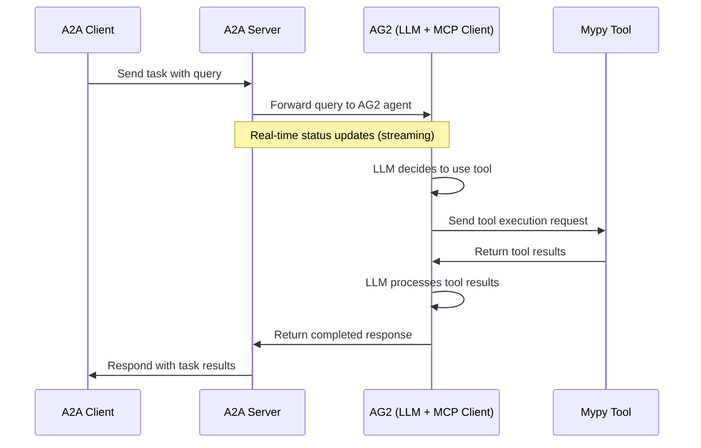

# AG2 Mypy tool Agent with A2A Protocol

This sample demonstrates an AG2 agent that is exposed through the A2A protocol. It shows how an AG2 can communicate
using A2A as a lingua franca, which is helpful for building a distributed agent system where different agents
can communicate with each other using the A2A protocol. The agent-as-a-service architecture allows you to encapsulate agent logic,
the local environment, tools, and other capabilities into a separate service that can be reused in different agent workflows.

Here is a sequence diagram that shows how the current demo implementation of the A2A protocol works:



## Possible use cases for Agent-as-a-Service architecture

- **Tool Access**: Leverage various MCP or custom tools for complex tasks.
- **Web Browsing**: Access to web browsing capabilities.
- **Code Execution**: Run Python code for data analysis tasks.
- **Image Generation**: Create images from text descriptions.
- **Real-time Streaming**: Get status updates during processing.
- **Cross-Framework Communication**: Demonstrates A2A's ability to connect different agent frameworks.

## The demo

This demo shows how to use the A2A protocol to communicate with an AG2 agent using a simple server/client architecture.

4. Run the remote agent:

```bash
uv run a2a_python_reviewer.py
```

5. In a new terminal, start an A2A client to interact with the remote `ReviewerAgent`. Choose one of the following:

- CLI client (generates CLI scripts):

```bash
uv run cli_codegen_a2a_client.py
```

- FastAPI client (generates FastAPI apps):

```bash
uv run fastapi_codegen_a2a_client.py
```

- Optional: WebSocket demo UI (visual demo only):

```bash
uv run websocket.py
```

Then open [http://127.0.0.1:9000](http://127.0.0.1:9000) in your browser for the pixel-art themed interactive demo.
    ```bash
    uv run a2a_python_reviewer.py
    ```

5. In a new terminal, start an A2AClient interface to interact with the remote (ag2) agent. You can use one of the following clients:

        ```bash
        uv run cli_codegen_a2a_client.py
        ```
        
        Generates CLI scripts and sends them to the reviewer for type checking.

    - **Method B: Run the FastAPI client**

        ```bash
        uv run fastapi_codegen_a2a_client.py
        ```

## Learn More

- [A2A Protocol Documentation](https://google.github.io/A2A/#/documentation)
- [AG2 Documentation](https://docs.ag2.ai/)
- [AG2 A2A Documentation](https://docs.ag2.ai/latest/docs/user-guide/a2a/)
- [MCP Documentation](https://modelcontextprotocol.io/introduction)

## Disclaimer

> [!WARNING]
> **The sample code provided is for demonstration purposes only.** When building production applications, it is critical
> to treat any agent operating outside of your direct control as a potentially untrusted entity.
>
> All data received from an external agent—including but not limited to its AgentCard, messages, artifacts, and task statuses—should be handled as untrusted input. For example, a malicious agent could provide an AgentCard containing crafted data in its fields (e.g., `description`, `name`, `skills.description`).
> If this data is used without sanitization to construct prompts for a Large Language Model (LLM), it could expose your application to prompt injection attacks. Failure to properly validate and sanitize this data before use can introduce security vulnerabilities into your application.
>
> Developers are responsible for implementing appropriate security measures, such as input validation and secure handling of credentials, to protect their systems and users.
