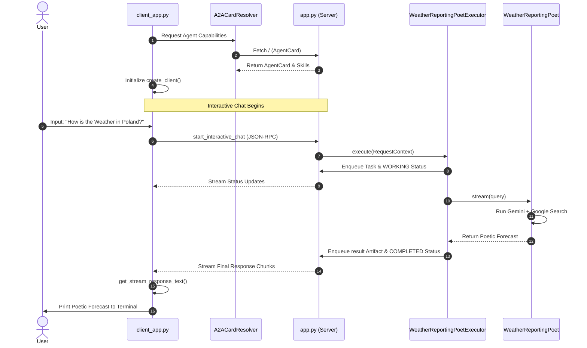

<!--
# Copyright 2025 Google LLC
#
# Licensed under the Apache License, Version 2.0 (the "License");
# you may not use this file except in compliance with the License.
# You may obtain a copy of the License at
#
#    https://www.apache.org/licenses/LICENSE-2.0
#
# Unless required by applicable law or agreed to in writing, software
# distributed under the License is distributed on an "AS IS" BASIS,
# WITHOUT WARRANTIES OR CONDITIONS OF ANY KIND, either express or implied.
# See the License for the specific language governing permissions and
# limitations under the License.

-->
# Get Started with A2A

This project implements a Google ADK-powered agent(A2A Server) that poetically reports weather updates. It leverages Google Search to gather factual weather data and presents it in the form of haikus or short poems, making weather forecasts engaging and unique.

DEMO: Using a simple A2A client(pure python), we will send queries and receive messages from A2A Server.

## ✨ Features

* **Poetic Weather Reports:** Delivers weather forecasts as haikus or poems, making them engaging and memorable.
* **Factual Accuracy:** Utilizes Google Search to fetch up-to-date and reliable weather information.
* **A2A Protocol:** Implements Agent-to-Agent communication standards for seamless integration.
* **Interactive Client:** A command-line interface for real-time interaction with the agent.
* **Modular Design:** Separated server, client, and agent components for clarity and maintainability.

## 📐 Architecture & Interaction Flow

Here is how the A2A Client and Weather Poet Server interoperate:



## 🚀 Technologies Used

* Python 3.x
* Google ADK (Agent Developer Kit)
* Google Gen-AI SDK
* `httpx` (for HTTP requests)
* `asyncio` (for asynchronous operations)
* `uvicorn` (for running the ASGI server)

### Important Clarification on A2A Implementation

This example showcases Agent-to-Agent (A2A) communication using the Google ADK and Gemini Models. It's crucial to understand that the A2A protocol itself is flexible and not tied to these specific technologies (or Models). You can build A2A-enabled agents and clients using various frameworks like LangGraph or CrewAI, and integrate them with different LLMs, to achieve interoperability between agents.

## 🛠 Setup and Installation

1.  **Clone the repository:**
    ```bash
    git clone https://github.com/a2aproject/a2a-samples.git
    cd a2a-samples/samples/python/agents/get_started
    ```
2.  **Create a virtual environment:**
    ```bash
    python -m venv venv
    ```
3.  **Activate the virtual environment:**
    * On macOS/Linux:
        ```bash
        source venv/bin/activate
        ```
    * On Windows:
        ```bash
        venv\Scripts\activate
        ```
4.  **Install dependencies:**
    ```bash
    pip install -r requirements.txt
    ```

## ▶️ Running the Application

The project provides a `Makefile` with convenient commands to manage its components.

### 1. Start the A2A Server

This command starts the core agent server, which exposes an API for clients to interact with.

```bash
make run_server
```

The server will run on `http://localhost:9999`.

### 2. Run the Client Application

This launches the interactive terminal client. It connects to the A2A server, displays the agent's capabilities, and allows you to send queries.

```bash
make run_client
```

Upon starting, the client will display the agent's card and automatically send an initial query for the weather in Warsaw, Poland.

### 3. Run the Agent Directly (for testing)

This command executes the agent's core logic directly without going through the A2A server. It's useful for testing the agent's functionality in isolation.

```bash
make run_agent
```

## 💬 Usage Examples

After running `make run_client`, you will see the agent's card details and then be prompted for input.

### Example Interaction

First start the server:

```text
$ make run_server
cd server && python app.py
INFO:     Started server process [60138]
INFO:     Waiting for application startup.
INFO:     Application startup complete.
INFO:     Uvicorn running on http://127.0.0.1:9999 (Press CTRL+C to quit)
INFO:     127.0.0.1:58052 - "GET /.well-known/agent-card.json HTTP/1.1" 200 OK
INFO:     127.0.0.1:58054 - "GET /.well-known/agent-card.json HTTP/1.1" 200 OK
INFO:     127.0.0.1:58056 - "POST / HTTP/1.1" 200 OK
INFO:     127.0.0.1:58148 - "POST / HTTP/1.1" 200 OK
```

Then start the client:

```text
$ make run_client
cd client && python client_app.py
====================================================
                     AgentCard                      
====================================================
--- General ---
Name        : Weather Reporting Poet
Description : Weather reporting Poet
Version     : 1.0.0

--- Interfaces ---
  [0] http://localhost:9999  (JSONRPC)

--- Capabilities ---
Streaming           : True
Push notifications  : False
Extended agent card : True

--- I/O Modes ---
Input  : text
Output : text

--- Skills ---
----------------------------------------------------
  ID          : weather_reporting_poet
  Name        : Weather Reporting Poet
  Description : Poet for latest weather updates
  Tags        : poet, weather
  Example     : How is the weather in Warsaw, Poland
  Example     : How is the weather in Hyderabad, India
====================================================
########################################
#### Weather Reporting Poet via A2A ####
########################################
To exit use `exit` or `quit`.
User> How is the Weather in Poland, Warsaw?
Model> The weather in Warsaw, Poland is currently cloudy with a temperature of 53°F (12°C) and a 10% chance of rain.

Here's a poetic look at the forecast for the next few hours:

Clouds drift in the sky,
A gentle breeze will softly sigh,
Temperatures hold,
As evening stories unfold.
---
User> How is the weather in India - Hyderabad ?
Model> The weather in Hyderabad, India for the next 4-6 hours is expected to be mostly clear with temperatures ranging from 30°C to 32°C. The wind will be around 14.4 km/h.

Here's a little weather poem for you:

Clear skies above,
A gentle breeze does blow,
Hyderabad nights,
Peaceful, soft, and low.
---
User> exit
#############################################
```

You can then type your own weather queries at the `user>` prompt. To exit, type `exit` or `quit`.

## 📝 Contributions

Contributions are welcome! Please open a pull request with your changes and follow the guidelines in [CONTRIBUTING](https://github.com/a2aproject/a2a-samples/blob/main/CONTRIBUTING.md)

## 📄 License

[Apache License - Version 2.0](https://github.com/a2aproject/a2a-samples/blob/main/LICENSE)
