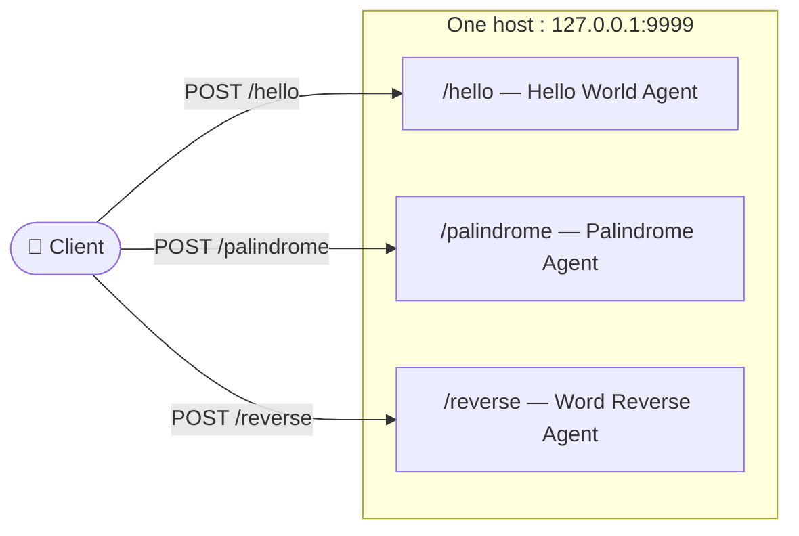

# A2A Multi-Tenancy Example — Many Agents, One Host

This sample shows how to host **three independent A2A agents behind a single
server** using **URL sub-path routing**.

The three agents are intentionally trivial "echo-style" mocks — the focus is on
*routing*, not on what the agents do:

| Sub-path | Agent | What it does |
|---|---|---|
| `/hello` | Hello World Agent | Replies with a friendly hello |
| `/palindrome` | Palindrome Agent | Says whether your text is a palindrome |
| `/reverse` | Word Reverse Agent | Reverses the order of your words |

## Background

The moment your team ships its second or third agent, an infrastructure question
shows up: *do we really want a separate hostname, certificate, and load balancer
for every agent?* In practice teams put a fleet of agents behind one host. From
the outside they share a domain; on the inside, each request still has to reach
exactly the right agent. That's multi-tenancy.

A2A is deliberately unopinionated here — it does **not** prescribe a routing
implementation. The protocol describes
[three complementary approaches](https://a2a-protocol.org/latest/topics/multi-tenancy/):
URL sub-path routing, authentication-header routing, and body-based routing with
the `tenant` field. **This demo focuses on the first one: URL sub-path routing.**

## A2A Multi-Tenancy with URL sub-path routing

In A2A Multi-Tenancy is possible in three ways:
1. URL sub-path routing
2. Authentication header-based routing
3. Body-based routing with the `tenant` field

The following sample focuses on URL sub-path routing. Refer to [A2A Multi-Tenancy](https://a2a-protocol.org/latest/topics/multi-tenancy/) for more information on the other two approaches.

### URL sub-path routing

In this approach, each agent gets its own URL prefix and advertises that URL in its own Agent
Card. Clients need no special awareness — they read the card and send requests
where it points. It's the simplest, most transparent option: you can read the
route straight out of an access log.



In this sample, `a2a_server.py` mounts each agent's Agent Card and JSON-RPC
endpoint on its own sub-path, and `a2a_client.py` discovers each agent by reading
its card and then sends requests to the URL the card advertises.

## Run it

Prerequisites: Python 3.10+ and the A2A SDK. Install the dependencies:

```bash
pip install -r requirements.txt
```

1. **Start the server** (hosts all three agents on port 9999):

   ```bash
   python a2a_server.py
   ```

   It prints the sub-path each agent is mounted on:

   ```text
   Serving three A2A agents (bind 127.0.0.1:9999, public http://127.0.0.1:9999):
     http://127.0.0.1:9999/hello  ->  Hello World Agent
     http://127.0.0.1:9999/palindrome  ->  Palindrome Agent
     http://127.0.0.1:9999/reverse  ->  Word Reverse Agent
   ```

2. **Run the client** in a second terminal. It discovers all three agents, shows
   a menu, and lets you chat with the one you pick:

   ```bash
   python a2a_client.py                 # non-streaming replies (default)
   python a2a_client.py --mode stream   # streaming replies
   ```

   A session looks like this:

   

3. **Inspect a card** directly:

   ```bash
   curl http://127.0.0.1:9999/hello/.well-known/agent-card.json
   ```

## Test it

`test_demo_app.py` is a small `pytest` suite (in the same spirit as the
`helloworld` sample). It starts `a2a_server.py` as a subprocess, waits until it's
ready, then — for each of the three tenant agents — sends a text message and
checks that a text reply comes back (a black-box round-trip test per agent).

```bash
pip install -r requirements.txt
pytest test_demo_app.py
```

Expected output:

```text
...                                                                      [100%]
3 passed
```

## Configuration

The server reads three environment variables, so the same code works whether you
run it locally or behind a different public address:

| Variable | Default | Purpose |
|---|---|---|
| `A2A_BIND_HOST` | `127.0.0.1` | Host/interface the server binds to (set to `0.0.0.0` to listen on all interfaces). |
| `A2A_PORT` | `9999` | Port the server listens on. |
| `A2A_PUBLIC_URL` | `http://127.0.0.1:9999` | URL advertised in each Agent Card (what clients connect to). |

The client reads `A2A_PORT` too, so it targets the same port as the server.

## Files

- `a2a_server.py` — the three echo "brains", one small `SimpleAgentExecutor`, and
  the Starlette app that mounts each agent's Agent Card + JSON-RPC endpoint on its
  own sub-path.
- `a2a_client.py` — interactive client: discovers all three agents, lets you pick
  one from a menu, and chats with it (non-streaming, or `--mode stream`).
- `test_demo_app.py` — `pytest` suite that boots the server and, for each agent,
  sends a message and checks a text reply comes back.

## Disclaimer

This sample is for demonstration and illustrates the mechanics of A2A
multi-tenancy. Treat any agent outside your control as untrusted: validate and
sanitize all data received from an external agent (AgentCard fields, messages,
artifacts, task statuses) before use, and implement appropriate auth and input
validation in production.
