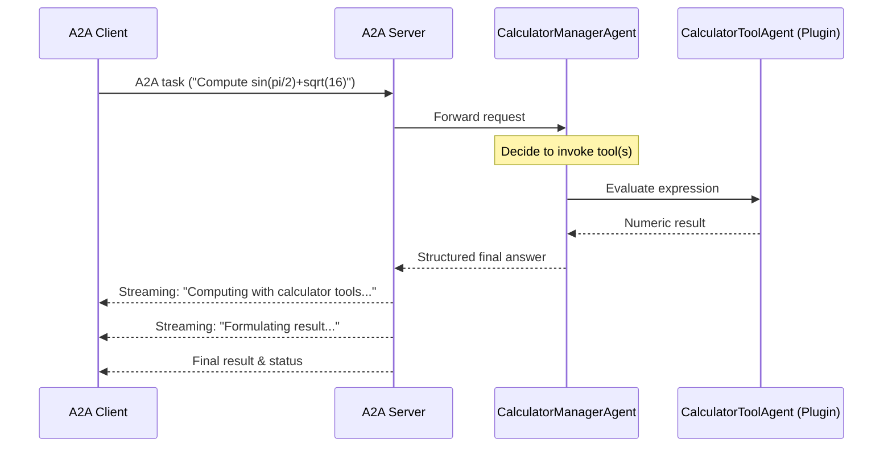

# Semantic Kernel Calculator Agent with A2A Protocol

This sample demonstrates how to implement a **calculator agent** built on [Semantic Kernel](https://github.com/microsoft/semantic-kernel/) and exposed through the A2A protocol. It showcases:

- **Tool / function calling**: Model chooses calculator functions (add, subtract, multiply, divide, safe expression evaluation)
- **Safe math expression evaluation**: Sandboxed AST evaluation for expressions like `sin(pi/2)+sqrt(16)`
- **Multi‑turn interactions**: Maintains conversational context via Semantic Kernel `ChatHistory`
- **Streaming responses**: Emits intermediate status updates while tools are invoked
- **Conversational memory**: Session‑scoped (in‑memory) state
- **Structured responses**: JSON schema (ResponseFormat) guides final answers



## Prerequisites

- Python 3.10 or higher
- [uv](https://docs.astral.sh/uv/)
- Valid Azure OpenAI (default) or OpenAI credentials (or configure another SK chat completion connector)

## Project Layout (Key Files)

```
semantickernel_hello_world/
  agent.py            # Calculator agent & plugin (replaces travel agent)
  __init__.py
  ... other server / runner modules (see sibling sample infrastructure)
```

Core class: `SemanticKernelCalculatorAgent` (replaces former travel agent). It wraps:
- `CalculatorToolAgent` plugin (with `CalculatorPlugin` functions)
- Manager agent performing routing & formatting

## Environment Configuration

Create a `.env` file (same directory as `agent.py`). The agent uses **Azure OpenAI** by default. To switch to OpenAI edit `agent.py` as shown below.

### OpenAI
```bash
OPENAI_API_KEY="your_api_key_here"
OPENAI_CHAT_MODEL_ID="gpt-4o-mini"   # example
```

### Azure OpenAI (default)
```bash
AZURE_OPENAI_API_KEY="your-azure-api-key"
AZURE_OPENAI_ENDPOINT="https://your-resource.openai.azure.com/"
AZURE_OPENAI_CHAT_DEPLOYMENT_NAME="your-deployment-name"
AZURE_OPENAI_API_VERSION="2024-12-01-preview"
```

### Switching Backends
In `agent.py` locate:
```python
chat_service = get_chat_completion_service(ChatServices.AZURE_OPENAI)
```
Change to:
```python
chat_service = get_chat_completion_service(ChatServices.OPENAI)
```

> [!NOTE]
> For other LLM providers configure the appropriate Semantic Kernel connector. See SK docs: Chat Completion Services.

## Setup & Run

1. Navigate to the sample directory:
```bash
cd samples/python/agents/semantickernel_hello_world
```

2. Create and activate environment:
```bash
uv python pin 3.12
uv venv
source .venv/bin/activate
```

3. Install & run (A2A server listens on port 10020 by default):
```bash
uv run .
```
Custom host/port:
```bash
uv run . --host 0.0.0.0 --port 8080
```

4. In a separate terminal run the A2A client sample:
```bash
cd samples/python/hosts/cli
uv run . --agent http://localhost:10020
```

## Example A2A Requests

POST to `http://localhost:10020` (JSON-RPC). Example synchronous calculation:

### Request
```json
{
  "jsonrpc": "2.0",
  "id": 1,
  "method": "message/send",
  "params": {
    "id": "calc-1",
    "sessionId": "session-abc",
    "acceptedOutputModes": ["text"],
    "message": {
      "role": "user",
      "parts": [ { "type": "text", "text": "Compute sin(pi/2)+sqrt(16)" } ]
    }
  }
}
```

### Possible Streaming Status Events (for message/stream)
```
Computing with calculator tools...
Formulating result...
```

### Response (final)
```json
{
  "jsonrpc": "2.0",
  "id": 1,
  "result": {
    "id": "calc-1",
    "status": { "state": "completed", "timestamp": "2025-04-01T16:53:29.301828" },
    "artifacts": [
      {
        "parts": [ { "type": "text", "text": "Result: 5.0" } ],
        "index": 0
      }
    ],
    "history": []
  }
}
```
(Here, `sin(pi/2)` = 1 and `sqrt(16)` = 4.)

## Calculator Plugin Functions
| Function | Description | Example |
|----------|-------------|---------|
| add(a,b) | Add two numbers | add 2 3 -> 5 |
| subtract(a,b) | a - b | subtract 10 4 -> 6 |
| multiply(a,b) | Multiply | multiply 6 7 -> 42 |
| divide(a,b) | Safe division | divide 8 0 -> Error |
| calculate(expression) | Safe expression evaluator (`+ - * / // % **`, math funcs) | calculate "sin(pi/2)+sqrt(9)" -> 4 |

The model/tooling layer chooses whether to call a function or produce a direct answer. Complex math should route through tools.

## Container (Optional)
If a `Containerfile` exists in this directory (or adapt from sibling samples):
```bash
cd samples/python
podman build -f agents/semantickernel_hello_world/Containerfile . -t sk-calculator-a2a
podman run -p 10020:10020 --env-file agents/semantickernel_hello_world/.env sk-calculator-a2a
```
> Replace `podman` with `docker` if preferred.

## Limitations
- In-memory session memory (ephemeral)
- Only text input/output
- Expression evaluator is intentionally restricted (no variables/function definitions)

## Security Considerations
All inbound data from external agents (AgentCard, artifacts, messages) must be treated as untrusted. Sanitize before injecting into prompts to mitigate prompt injection & data exfiltration risks.

## References
- A2A Protocol: https://google.github.io/A2A/#/documentation
- Semantic Kernel Docs: https://learn.microsoft.com/en-us/semantic-kernel/

## Disclaimer
Important: This sample is for demonstration purposes. Harden, validate inputs, and securely manage credentials before any production deployment.